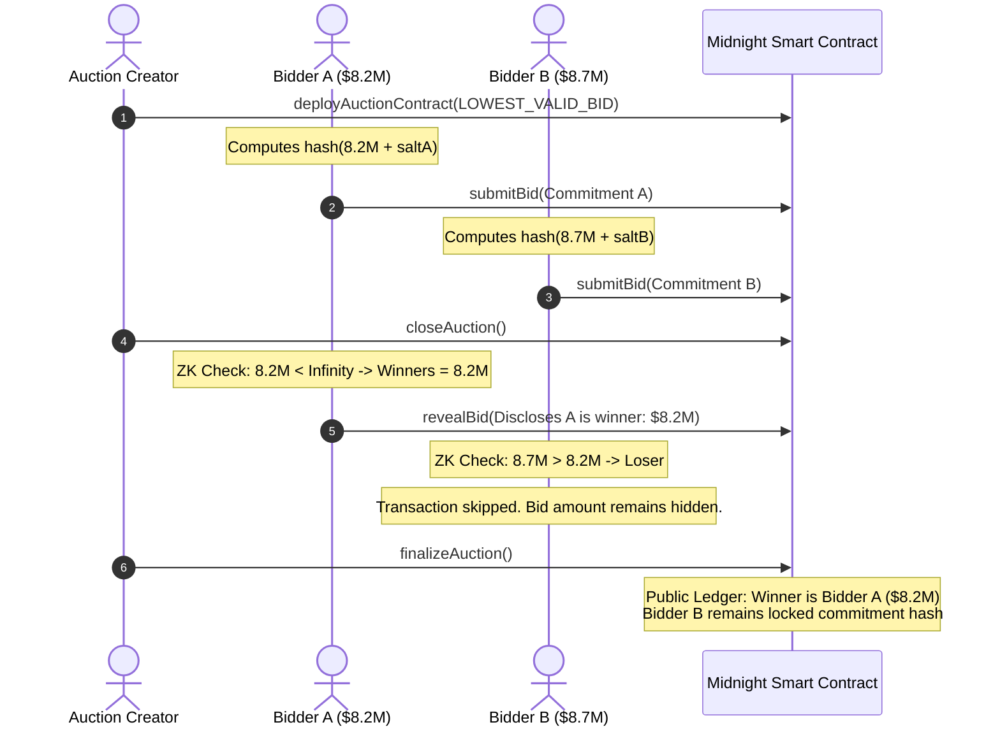

# PrivateBid

### "Bid privately. Verify publicly."
*Sealed bids without exposing competing pricing to competitors.*

---

## 1. Problem
Traditional procurement, infrastructure contracting, and civil tenders suffer from major confidentiality flaws:
- **Collusion & Price Fixing:** Competitors observing other bids can coordinate pricing or front-run competitors.
- **Strategic Under-cutting:** Publicly exposing bids allows late bidders to artificially undercut competitors by small margins, destroying market integrity.
- **Centralized Trust Fallacy:** Hiding bids in a traditional database relies entirely on the host's integrity. Inside employees or hackers can easily leak bid amounts.

## 2. Solution
**PrivateBid** is a privacy-preserving sealed-bid digital procurement framework. Using the Midnight blockchain and ZK smart contracts:
1. Contractors submit bids as encrypted cryptographic commitments.
2. The bidding values remain private on-chain during the tender period.
3. Once closed, the winner is calculated in zero-knowledge and disclosed publicly.
4. Losing bid amounts remain sealed, preserving contractor privacy while proving the result is 100% fair.

## 3. Why Midnight?
PrivateBid leverages the Midnight Network to solve problems that other blockchains cannot:
- **Selective Disclosure:** Unlike Ethereum or Cardano where all smart contract states are fully public, Midnight supports **private state**. The bid amounts are verified off-chain inside ZK-circuits and never written to the ledger in plaintext.
- **Programmable Privacy:** Midnight's Compact language allows writing standard TypeScript-like code that compiles directly into cryptographic proving/verifying keys, making zero-knowledge development accessible.
- **Decentralized Execution:** The bidder generates their proof locally on their machine, ensuring their private keys, salts, and plaintext bid amounts never leave their device.

---

## 4. Key Features
- **Shielded Bid Submission:** Bid amounts and unique salts are committed on-chain as a SHA-256 hash.
- **Decentralized Winner Reveal:** Bidders run a local circuit to check if they are the lowest bidder. If they are, they submit a transaction to update the ledger. If they lost, their transaction is skipped, keeping their bid 100% secret.
- **Public Verifiability:** Observing citizens and audit offices can run the verifier proof to mathematically audit that the true winner was selected without exposing losing bids.
- **Midnight Lace Wallet Integration:** Integrates with the official Lace wallet connector to sign transactions and derive public keys in zero-knowledge.

---

## 5. Architecture & Privacy Model

### Bidding and Verification Flow



---

## 6. Technology Stack
- **Frontend:** React 19, TypeScript, Vite 8, Tailwind CSS v4, Lucide Icons, React Router v7.
- **Smart Contracts:** Compact (Minokawa) Smart Contract Language.
- **Integrations:** Midnight.js Client SDK (`@midnight-ntwrk/midnight-js-contracts`), Lace Wallet DApp connector API.
- **Cryptography:** SHA-256 local hashing (`js-sha256`), ZK-SNARK provers.

---

## 7. Project Structure
```
privatebid/
├── midnight/
│   ├── contracts/
│   │   └── privatebid.compact   <-- Compact Smart Contract Logic
│   └── tests/
│       └── privatebid.test.ts   <-- Smart Contract State Transition Tests
├── src/
│   ├── components/
│   │   ├── WalletButton.tsx     <-- Lace Wallet connector UI
│   │   ├── ZKProofProgress.tsx  <-- Visual ZK proof stepper
│   │   └── PrivacyVisualizer.tsx<-- Interactive selective disclosure visualizer
│   ├── context/
│   │   └── WalletContext.tsx    <-- Global wallet state context
│   ├── pages/
│   │   ├── Landing.tsx          <-- Landing page & Deploys contracts
│   │   ├── Explore.tsx          <-- Search & Filter procurement tenders
│   │   ├── AuctionDetail.tsx    <-- Bidding & Revealing panel
│   │   ├── Dashboard.tsx        <-- Bidder registry & Deployed contracts
│   │   ├── AdminConsole.tsx     <-- Owner administrative portal
│   │   └── AuditVerify.tsx      <-- Public cryptographic verifier report
│   ├── services/
│   │   └── midnightService.ts   <-- SDK wrappers & Cryptographic simulation
│   ├── App.jsx                  <-- Routing & navigation wrapper
│   ├── main.jsx                 <-- React entrypoint
│   └── index.css                <-- Tailwind styles & animations
├── index.html
├── tsconfig.json                <-- TypeScript Compiler Configuration
├── package.json
└── README.md
```

---

## 8. Local Development

### Prerequisites
- Node.js v20 or higher
- npm or yarn

### Installation
1. Clone the repository and navigate to the project directory:
   ```bash
   git clone <repository-url>
   cd privatebid
   ```
2. Install npm packages:
   ```bash
   npm install
   ```
3. Start the Vite hot-reloading development server:
   ```bash
   npm run dev
   ```
4. Open [http://localhost:5173](http://localhost:5173) in your browser.

---

## 9. Midnight Setup & Contract Deployment
To compile and deploy the smart contract on the actual Midnight devnet:

### 1. Install the Compact CLI (WSL/Linux required)
```bash
curl --proto '=https' --tlsv1.2 -LsSf https://github.com/midnightntwrk/compact/releases/latest/download/compact-installer.sh | sh
source ~/.bashrc
compact update
```

### 2. Run local Proof Server (Docker required)
```bash
docker run -p 6300:6300 midnightntwrk/proof-server:8.0.3
```

### 3. Compile the contract
Compile the contract to generate TypeScript interfaces and ZK keys:
```bash
compact compile midnight/contracts/privatebid.compact midnight/contracts/managed/privatebid
```

### 4. Configure Environment Variables
Copy `.env.example` to `.env` and configure your Node endpoints:
```bash
cp .env.example .env
```

---

## 10. Testing
To run the smart contract state transition tests:
```bash
# Run tests
npm test
```

---

## 11. 2-Minute Judge Demo Script

### 0:00 - Problem
*"Traditional digital procurement can expose sensitive bidding information. Competitors can undercut each other, or centralized hosts can leak bids, destroying fairness."*

### 0:15 - Solution
*"PrivateBid lets contractors submit sealed bids while keeping competing bids confidential. The smart contract selects the lowest valid bid in zero-knowledge."*

### 0:30 - Create/Open Auction
*As the **Auction Creator**, deploy a contract for the "NH-33 Highway Expansion". Set category to 'Infrastructure' and the bidding method to 'Lowest Valid Bid'.*

### 0:45 - Connect Midnight Wallet
*As a **Bidder**, connect your Midnight Lace wallet. The dashboard shows your derived public address and registered bids.*

### 1:00 - Submit Private Bid
*Enter your bid amount (e.g. $8,200,000). Submit. The visualizer shows compilation, witness loading, ZK proof generation, and node broadcast. Only the commitment hash is written to the ledger.*

### 1:15 - Auction Closes
*Switch to the Creator Console. Lock the submissions to close the auction, triggering the reveal phase.*

### 1:30 - Winner Determined
*Bidders click 'Reveal Bid' to run the ZK verifier locally. The bidder who bid $7.9M reveals and is registered as the winner. The bidder who bid $8.7M reveals locally, notices they lost, and skips node submission, keeping their losing bid 100% secret.*

### 1:45 - Verification
*Open the Audit Report. Click 'Run Verification Audit'. Watch the verifier verify the winning hash matches and verify that losing commitments remain sealed.*

### 2:00 - Final Statement
*"PrivateBid doesn't just put auctions on a blockchain. It makes privacy part of how the auction works. Bid privately, verify publicly."*

---

## 12. Security
- **Salt Collision:** Unique 32-byte salts prevent rainbow table attacks.
- **Identity Proofs:** derived keys ensure bidders can only reveal the commitments they own.
- **Immutable finalization:** State changes can only transition sequentially: `DRAFT -> OPEN -> CLOSED -> RESULT_AVAILABLE`. Finalized results cannot be rewritten.

## 13. Limitations
- Native Windows compilation is currently unsupported by the Midnight CLI, requiring WSL.
- Network latency: Local proof generation takes 1-2 seconds per circuit execution.

## 14. Future Roadmap
- **Shielded Multi-Criteria Scoring:** Determining winners based on quality scores + bid values in ZK.
- **Multicurrency Settlements:** Integrations with shielded asset transfers to pay the contract deposit automatically upon winning.
# privatebid

